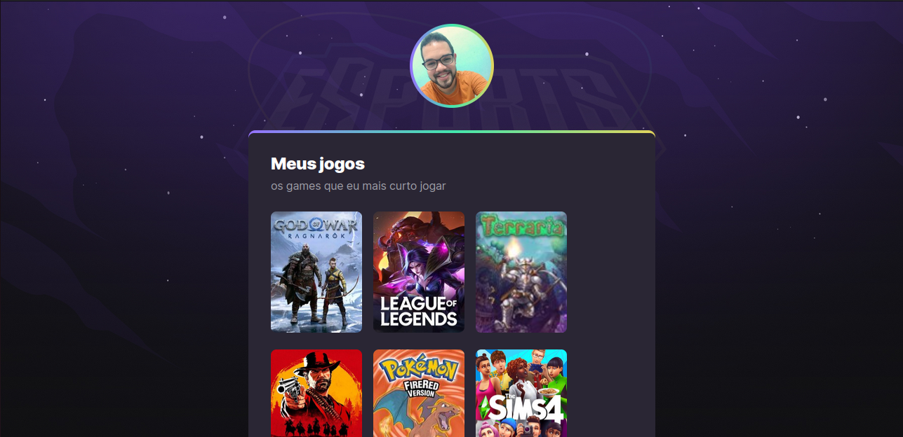
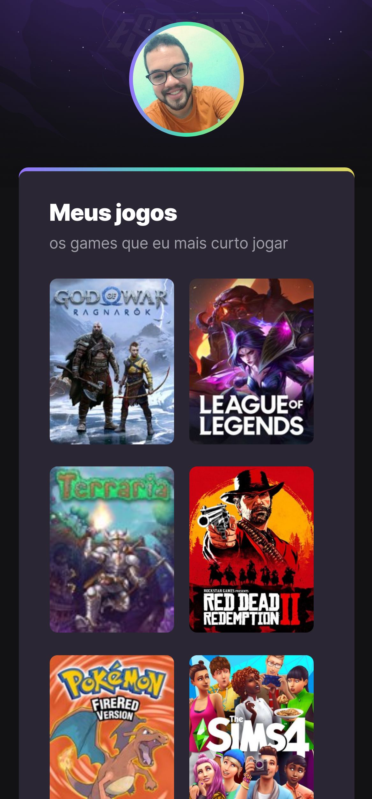

<h1 align="center"> NLW eSports </h1>

  <a href="#-tecnologias">Tecnologias</a>&nbsp;&nbsp;&nbsp;|&nbsp;&nbsp;&nbsp;
  <a href="#-projeto">Projeto</a>&nbsp;&nbsp;&nbsp;|&nbsp;&nbsp;&nbsp;
  <a href="#-layout">Layout</a>&nbsp;&nbsp;&nbsp;|&nbsp;&nbsp;&nbsp;
  <a href="#memo-licença">Licença</a>

  

 

<h1>Desktop:</h1>
  
 
<h1>Mobile:</h1>
  

## 🚀 Tecnologias

Esse projeto foi desenvolvido com as seguintes tecnologias:

- HTML e CSS
- Git e Github
- JavaScript
- Vanilla tilt js

## 💻 Projeto

O projeto foi construído durante o evento Next Level Week da Rocketseat. O objetivo foi construir uma pagina com meus jogos e canais de stream favoritos alem
de colocar minhas redes sociais para que outras pessoas possam se conectar comigo. Para deixar o projeto mais customizado utilizei a biblioteca vanilla tilt
js que e uma biblioteca de animacoes 3D aplicado dessa forma nos cards dos games que mais gosto.

## 🔖 Layout

Você pode visualizar o layout do projeto através [DESSE LINK](https://www.figma.com/file/WtVAk84UK5m8kN9ppOcrU4/NLW-eSports-(Community)?node-id=79%3A2502&t=3dDRm7bmne6Ng0Xp-0). É necessário ter conta no [Figma](https://figma.com) para acessá-lo.

## :memo: Licença

Esse projeto está sob a licença MIT.

---
